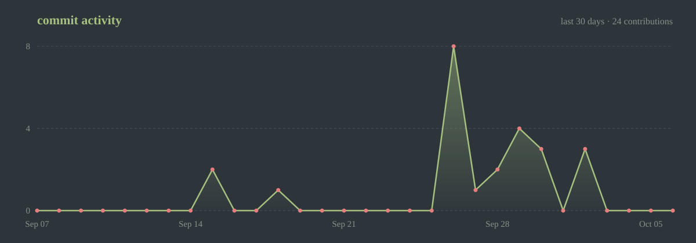

<div align="center">


<br>

<a href="https://vansh-portfolio-asf4.vercel.app/"></a>
<a href="https://www.linkedin.com/in/vansh-rajput-95348a270/"></a>
<a href="mailto:vanshdev0101@gmail.com"></a>
<a href="https://github.com/vanshdev0101?tab=repositories"></a>

</div>

<br>

```console
vansh@github ~
$ whoami

  Vansh C
  B.Tech Computer Science and Engineering (AI/ML) · SRM Institute of Science and Technology · 2023–2027
  Chennai, India

$ cat about.txt

  I build things that have to survive contact with the real world —
  inference pipelines that hold latency budgets, security tooling that
  catches actual attacks, and a Linux desktop I use every day.

  Most of what I ship starts as something that annoyed me.
```

<br>

## `$ ls -la ~/projects`

```console

drwxr-xr-x  Airlock/            python      supply-chain malware scanner
drwxr-xr-x  VeritasXR/          python      chest x-ray diagnosis + uncertainty
drwxr-xr-x  quiet-mic/          shell       pipewire echo cancellation
drwxr-xr-x  ghostseat/          c++         flexnet licence-log root cause
drwxr-xr-x  Orbit/              typescript  distributed job scheduler
drwxr-xr-x  LaptopGuard/        typescript  windows endpoint monitor
drwxr-xr-x  surface-dots/       qml         hyprland desktop shell
```

<table>
<tr>
<td width="50%" valign="top">

### 🛡️ [Airlock](https://github.com/vanshdev0101/Airlock)
`python`

AI-powered security scanner for Hugging Face and GitHub repositories. Detects malware, typosquatting, and supply-chain attacks **before you clone**.

Built after a fake OpenAI repo on Hugging Face was downloaded 244,000 times carrying a multi-stage infostealer that bypassed Windows Defender. Airlock scores it **< 10 / 100**.

</td>
<td width="50%" valign="top">

### 🩻 [VeritasXR](https://github.com/vanshdev0101/-VeritasXR-Chest-X-Ray-Diagnosis-with-Clinical-Uncertainty)
`python` · `pytorch` · `tensorrt` 

Dual-pathway CNN for pneumonia detection that learns local and global features in parallel, using inter-path disagreement as an intrinsic uncertainty signal for clinical triage.

| | latency | throughput |
|---|---|---|
| FP32 | 18.1ms | 55 img/s |
| **TensorRT FP16** | **2.2ms** | **447 img/s** |

**8.1× speedup**, deployed on NVIDIA Triton.

</td>
</tr>
<tr>
<td width="50%" valign="top">

### 🛰️ [Orbit](https://github.com/vanshdev0101/ORBIT)
`typescript` · `postgres` · `next.js`

Distributed job scheduling platform — Postgres schema → Express REST API → Node worker service with polling, atomic claiming, retries and a dead-letter queue → Next.js dashboard.

Built for backend correctness under concurrency, not frontend polish.

</td>
<td width="50%" valign="top">

### 💻 [LaptopGuard](https://github.com/vanshdev0101/LaptopGaurd)
`typescript` · `c#` · `windows`

Windows endpoint security monitor. On a failed login it captures Event ID 4625 from the Security Log, takes a webcam photo as evidence, snapshots running processes, and tracks USB activity.

Real-time authenticated dashboard, reachable remotely over Tailscale.

</td>
</tr>
<tr>
<td width="50%" valign="top">

### 🎙️ [quiet-mic](https://github.com/vanshdev0101/quiet-mic)
`shell` · `pipewire`

Reboot-safe acoustic echo cancellation for PipeWire. The WebRTC AEC module ships with PipeWire, but no persistent working config existed, so this is one, plus a script that **measures** it: plays a tone, records raw vs. cancelled mic, and asserts the dB drop.

Found and fixed a silent failure where a missing device made the check pass anyway.

</td>
<td width="50%" valign="top">

### 👻 [ghostseat](https://github.com/vanshdev0101/ghostseat)
`c++17` · `no dependencies`

Root-cause analysis for FlexNet Publisher (`lmgrd`) licence logs. Rebuilds who held which seat across a log with no dates or session ids, and names why a checkout was denied, e.g. a *ghost seat* held by a client that is already gone.

</td>
</tr>
</table>

<br>

## `$ git shortlog --upstream`

Bug fixes sent to other people's projects.

| project | change | status |
|---|---|---|
| [caelestia-dots/shell](https://github.com/caelestia-dots/shell/pull/1827) `qml` | Recorder UI desynced from recordings started by keybind; synced state with external recordings (#1805) | **merged** |
| [Alexays/Waybar](https://github.com/Alexays/Waybar/pull/5247) `c++` | `hyprland/language` mis-parsed `activelayout` when a keyboard name contains parentheses; now splits on the last comma outside parens (#4586) | open |
| [pytorch/pytorch](https://github.com/pytorch/pytorch/pull/198617) `python` | Reviewed someone else's `Normal.log_prob` overflow fix, stress-tested it independently: 569 cases across float32/64, CPU and CUDA, plus `gradcheck` | review comment |


<br>

## `$ cat stack.txt`

```console
python      ████████████████████████  8 repos   ml · pipelines · security tooling
typescript  ██████                    2 repos   apis · dashboards · workers
jupyter     ███                       1 repo    analysis · experiments
qml / lua   ██████                    active    hyprland desktop shell
```

```console
$ printf '%s\n' "$TOOLS"

  ml        pytorch · tensorrt · triton · scikit-learn · pandas · numpy
  backend   flask · express · node · postgres · sqlite
  frontend  next.js · typescript · html · css
  systems   linux · hyprland · pipewire · quickshell · bash · git · c++ · rust (reading)
```

<br>

## `$ git log --oneline --author=vansh`

```console
* merged     caelestia-dots/shell #1827 — recorder state sync
* open       Alexays/Waybar #5247 — hyprland/language parsing fix
* shipped    quiet-mic (PipeWire AEC), ghostseat (licence-log RCA), Airlock
* shipped    a full Hyprland desktop shell in QML, upstreamed to surface-dots
* building   ML model deployment — serving, quantisation, latency budgets
* building   advanced DSA
* competed   Appathon · HackVers
* built      web for Networking Nexus & ACM SIGKDD
```

<br>

## `$ uptime`

<div align="center">


</div>

<br>
<div align="center">



</div>

<br>

<div align="center">
<sub><code>$ </code>Questions about any of this? <a href="https://github.com/vanshdev0101/vanshdev0101/issues">Open an issue</a> · <a href="mailto:vanshdev0101@gmail.com">vanshdev0101@gmail.com</a></sub>
</div>
